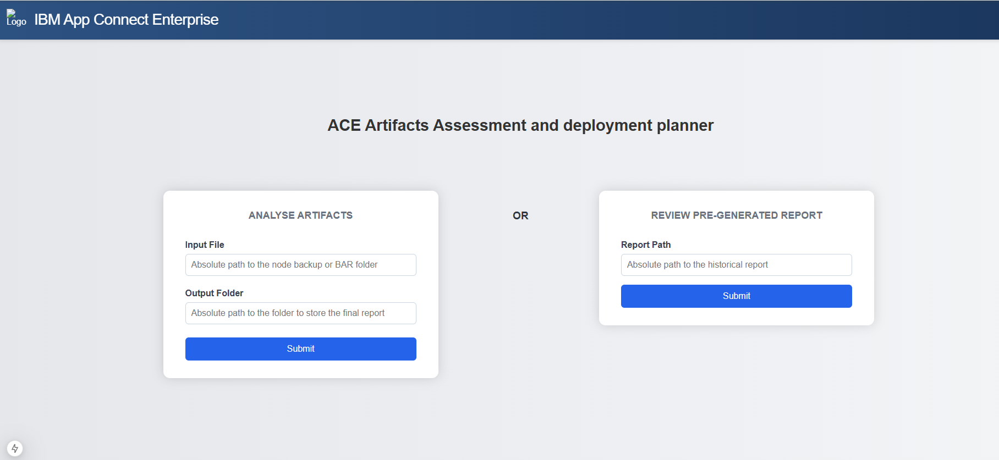
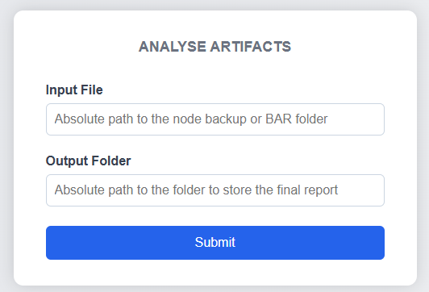
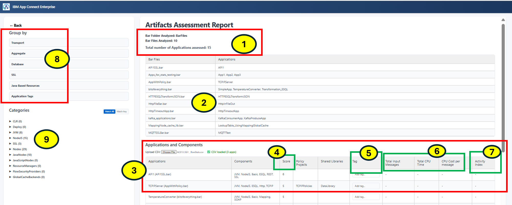
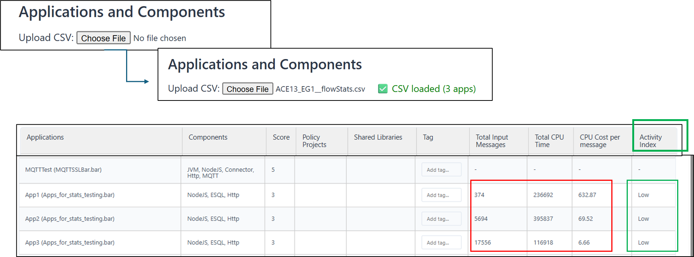
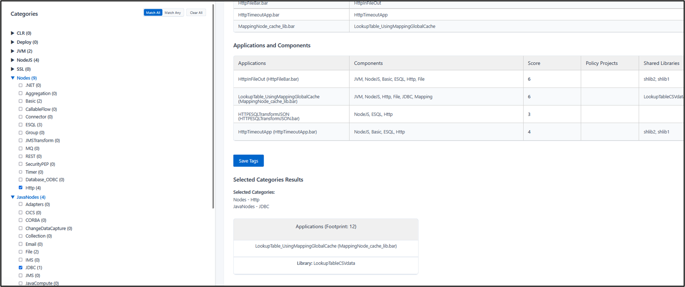
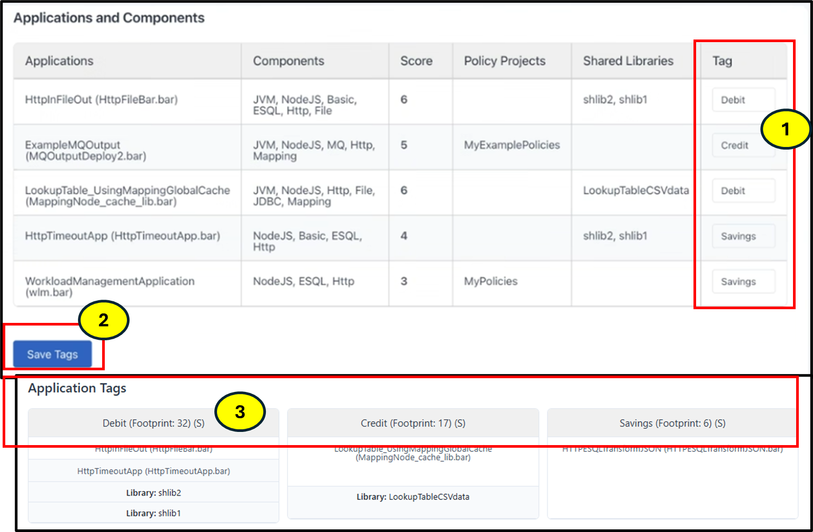
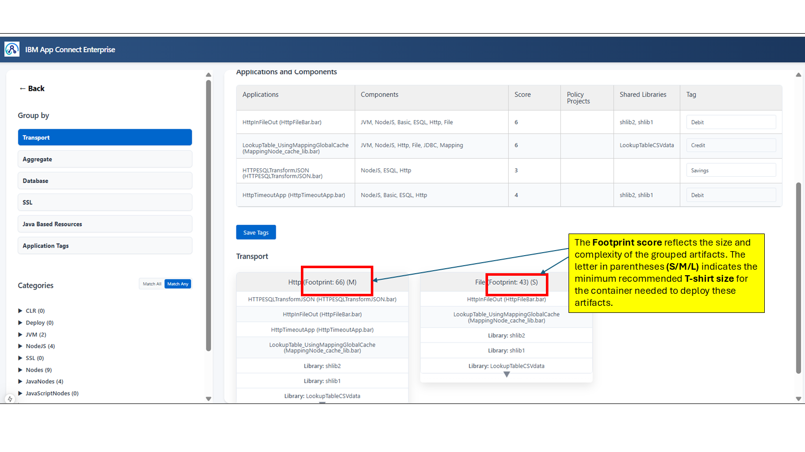
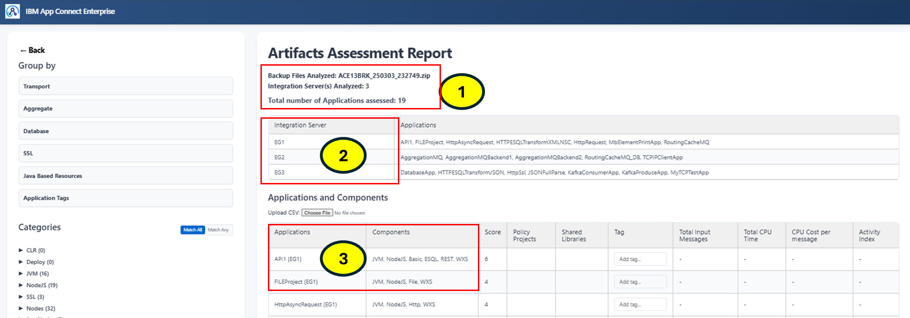
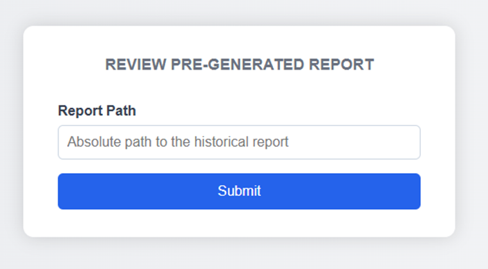

The ACE Artifacts Analyzer is an intelligent analysis and planning utility designed to optimize the deployment of IBM App Connect Enterprise (ACE) artifacts to containerized environments. When migrating or deploying large-scale integration solutions—comprising Applications, REST APIs, Integration Services, Shared Libraries, and Message Flows—this tool provides data-driven insights and recommendations for optimal artifact grouping strategies, helping towards:

- Faster startup times for the Integration Runtime
- Optimized memory usage through logical grouping
- Minimal service disruption during configuration updates

The utility supports both BAR files and Integration Node backups.

## ACE Artifacts Analyzer and Deployment Planner - Setup Guide

### Prerequisites

Before you begin, ensure the following tools are installed on your system:

- **Java 17**
- **Maven 3.9.9**    [Installation Instructions](https://maven.apache.org/install.html)
- **Node.js 20+**
- **npm 9+**
- **Git**    [Installation Instructions](https://github.com/git-guides/install-git)


### Setting up the utility on macOS


1. **Clone the Repository**

   ```bash
   git clone https://github.com/ot4i/ace-artifacts-analyzer.git

2. **Setup the frontend**

    Navigate to the 'frontend' directory and install dependencies:

    ```bash
    cd frontend
    npm install
    ```


3. **Build the project**
   
    In project root, run:
     ```bash
      mvn install
     ```
4. **Start the Backend program**

   You must set the **MQSIPROFILE_PATH** Environment Variable in the same terminal session you are running backend.
        The variable should be set to the path of the mqsiprofile executable present in ACE installation. A sample path is given below.

       
       export MQSIPROFILE_PATH="/Applications/IBM App Connect Enterprise 13.0.7.0.app/Contents/mqsi/server/bin/mqsiprofile"
       echo $MQSIPROFILE_PATH
       cd backend
       mvn spring-boot:run
       
  6. **Start the frontend program**
     
      From project root,  run:
      ```bash
      cd frontend
      npm run dev
      ```


### Setting up the utility on Windows:


 1. **Clone the Repository**
     
     ```
     git clone https://github.com/ot4i/ace-artifacts-analyzer.git
     ```

  
  2. **Setup the frontend**
     
     a)From the project root, run:
     
     ```
     cd frontend 
     npm install
     ```
     
      b) Set the MQSIPROFILE_PATH Environment Variable to point to ACE’s mqsiprofile location
     
      ```
      set MQSIPROFILE_PATH="C:\Program Files\IBM\ACE\13.0.7.0\server\bin\mqsiprofile.cmd"
      ```

 3. **Build the project**
   
    In project root, run:
     ```bash
      mvn install
     ```
     
4. **Start the Backend program**

    From the project root, run:

      
    ```bash
      set MQSIPROFILE_PATH="C:\Program Files\IBM\ACE\13.0.7.0\server\bin\mqsiprofile.cmd"      
      cd backend
      mvn spring-boot:run
     ```


5. **Start the frontend program**
   
   Open a new command window. From the project root, run:
     
     ```
     cd frontend
     npm run dev
     ```


## Analyzing Artifacts

Once both the frontend and backend are running:
- Open your browser (preferably Google Chrome).
- Navigate to: http://localhost:3000
- You should see the application's landing page.

        
This should provide you with the landing page as shown below:



 If you are analyzing the artifacts for the first time, use the Text box to enter the details of the artifacts:

 

 ## 📝 Providing Input and Output Paths

### 📂 Input File

You have two options for the type of input:

- **Analyzing BAR Files:**  
  Enter the **absolute path** to the directory containing the BAR files.  
  > ✅ You can include multiple BAR files in this folder.

- **Analyzing an Integration Node Backup:**  
  Enter the **absolute path** to the `.zip` file containing the Integration Node backup.  
  > ⚠️ Only one backup file can be analyzed at a time.

### 📁 Output Folder

Specify the **absolute path** to an **empty folder** where the analysis reports will be saved.

---

### ▶️ Start Analysis

Once the input and output paths are provided, click the **Submit** button to begin analyzing the artifacts.


## Interpreting the assessment report

### Report Generated from assessment of BAR file(s).





1. **BAR or Backup Summary**  
   Displays details about the BAR folder or Integration Node backup and the total number of applications analyzed.

2. **BAR File or Integration Server Analysis Table**  
   Presents information for each analyzed BAR file or the Integration Server (if the input was a backup file), including the applications contained within them.

3. **Application and Components Table**  
   Provides insights into each application, its associated components (as derived from `server.components.yaml`), referenced shared libraries, and policy projects.

4. **Component Usage Score**  
   Indicates the number of components utilized by each application, based on internal analysis of `server.components.yaml`.

5. **Tagging Feature**  
   Allows users to label applications based on business functions, functional associations, or other criteria to facilitate easy grouping and filtering.

6. **Application Statistics**  
   Displays metrics such as:
   - Total input messages
   - Total CPU time
   - CPU cost per message  
   These metrics are available when the user uploads Message Flow Accounting and Statistics data.

7. **Activity Index**  
   Shows either **High** or **Low** to reflect how resource-intensive or busy an application is. This index is derived from uploaded Flow Accounting and Statistics data.

8. **Group By Section**  
   Offers predefined grouping options based on artifact characteristics.  
   For example, grouping by **Transport** will cluster artifacts using similar protocols such as MQ, HTTP, or TCP/IP.

9. **Categories Section**  
   Provides users with fine-grained control to define custom grouping criteria for artifacts based on their preferences.


### Inputting Message Flow Statistics and Accounting data




### Customized grouping using Categories




1.	The categories section provides several component areas that represent the server.components.yaml generated by ibmint optimize server command.
You can expand each of the component categories and get more detailed information. The number in the bracket indicates the number of applications having those components. For example ESQL(3)  suggests that there are 3 applications that use ESQL.

2.	Match Any or Match All  allows you to group the applications in specific manner based on the selected components from the categories.
Match Any: Group together applications that match any one of the selected components
Match All: Group together applications that match all the selected components.
3.	Displays the list of selected components
4.	Application grouping based on the selected components and match criteria.


### Assigning labels to the applications



1.	The ‘Tag’ column provides editable text box where user can enter the label that they want to assign to the application. 
2.	Use ‘Save Tags’  button to persist the change on the disk, so that they are available when reports are viewed in offline mode at a later time.
3.	When Group by ‘Application Tags’ option is selected,  the Applications are grouped based on the labels displayed under the labelled boxes.

### Understanding Footprint score and Container Sizing guidance



Footprint is calculated based on Heuristic logic taking into account the Application score, its dependent libraries, policies.

The letters (S/M/L) in parentheses represents , SMALL, MEDIUM, LARGE, and  serve as guidance for the minimum recommended T-shirt size of the target container. These recommendations are approximate and based on observed patterns. However, users are encouraged to assess their specific needs by considering additional factors such as message size, peak load, auto-scaling requirements, and overall deployment context.
The current guidance of Footprint score to T-shirt size is assumed as below:

Footprint Score 1-50 : S

Footprint Score 51-100 : M

Footprint Score 101+ : L


## Report Generated from assessment of Integration Node backup




1.	Displays the name of the backup file that was analyzed
2.	The table lists the name of IntegrationServers that were found in the backup and the applications deployed to them
3.	The table show list of applications and associated components. In the bracket next to Application Name you will observe the Integration Server the application belongs to.
 Rest of the information remain the same as described above.


## Viewing Reports in offline mode

If you run the assessment on your artifacts and may want to revisit / review at later time, you can use following option to reload your assessment report on the home page



The reports that are generated during assessment have this naming format 
Consolidated_[BarFolder Name]_OptimizerReport.txt   OR
Consolidated_[IntegrationNode backup name]_OptimizerReport

To view Assessment report in offline mode,  enter the absolute path to the folder that contains the pre-generated report.


## ⚙️ How the Utility Works

The utility analyzes either **BAR files** or an **Integration Node backup** to determine which components and capabilities are required by the integration artifacts. It uses the `ibmint optimize server` command to assess component usage and produces detailed reports in both `.json` and `.txt` formats.

---

### 📦 BAR Files

1. The utility scans the specified input directory for **BAR files**.
2. For each BAR file found:
   - A **working directory** is created.
   - The BAR file is **deployed** into this directory.
   - Each **Application**, **REST API**, or **Service** within the `run` directory is:
     - Copied to a **temporary workspace**.
     - Processed using the `ibmint optimize server` command.
3. The `server.components.yaml` file generated from the optimization step is analyzed to identify the server capabilities required by the application.
4. A detailed **application-level report** is generated in both `.json` and `.txt` formats.
5. All application reports are aggregated into a **BAR-level summary report**.
6. Finally, all BAR-level reports are consolidated into a single, final report that outlines which applications require specific integration server components or functionalities.

---

### 📁 Integration Node Backup

1. The utility **extracts** the contents of the provided Integration Node backup `.zip` file.
2. It iterates through each **server directory** found within the backup.
3. For every server:
   - It loops through all **Applications**, **REST APIs**, and **Services** in the `run` directory.
   - Each is copied into a **temporary workspace** and analyzed using the `ibmint optimize server` command.
4. The resulting `server.components.yaml` file is used to produce an **application-level report** (`.json` and `.txt`).
5. These reports are then compiled into a **server-level intermediate report**.
6. Finally, all server-level reports are merged into a single **comprehensive report**, summarizing the required components and capabilities across all applications.

---

### 📊 Reporting Summary

At the end of either workflow (BAR or backup), the utility provides:

- **Application-level reports** detailing required server components.
- **Intermediate reports** (per BAR or server).
- A **final consolidated report** showing which components are essential for deployment and execution of the applications.


### Disclaimer: This code is provided in good faith and AS-IS. There is no warranty or further service implied or committed and any supplied sample code is not supported via IBM product service channels. You may submit a question in the issues, but a response is not guaranteed. 
